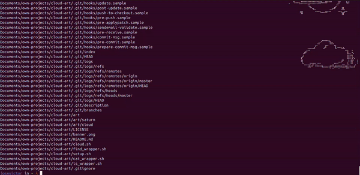

# ☁️ Cloud

Cloud is a minimalist, poetic overlay for your terminal.  
It surprises you with ASCII art that blends into the output of common shell commands — like `ls` — when the layout allows it.



## ✨ What it does

Cloud watches your command output and, when the space is right, lets a cloud (or another piece of ASCII art) softly drift in — aligned, subtle, and non-intrusive.

- It only triggers for safe, read-only commands like `ls`
- It calculates whether there’s enough **horizontal and vertical space** to fit art beside your output
- If it fits, it **renders the art to the side**
- If not, it does nothing — like a cloud that just passed

The entire logic is implemented in Bash using standard tools (`find`, `wc`, `mapfile`, `printf`, etc.), without touching your shell's internal behavior, cursor state, or command history.

## Usage

```bash
Usage: cloudcfg [COMMAND] [SUBCOMMAND] [ARGUMENTS]
Commands:
    art                 Manage ascii art files
        add             [FILENAME]
        remove          [FILENAME]
        show            [FILENAME]
        list
    command:            Manage commands wapped by cloud. eg. cat, ls, find
        add             [COMMAND]
        remove          [COMMAND]
        list
    help:               Print this message
    config:             Manage configs.
        To be implemented
    profile:            Manage sets of arts, configs and commands
        To be implemented
```

## 🛠 How it works

Cloud works by aliasing commands like `ls` with a Bash script that:

1. Runs the command and captures its output
2. Calculates the width of your terminal and the height/width of each piece of ASCII art
3. Scans the output for space where art could fit beside it
4. If space is found, the art is injected into the buffer before printing
